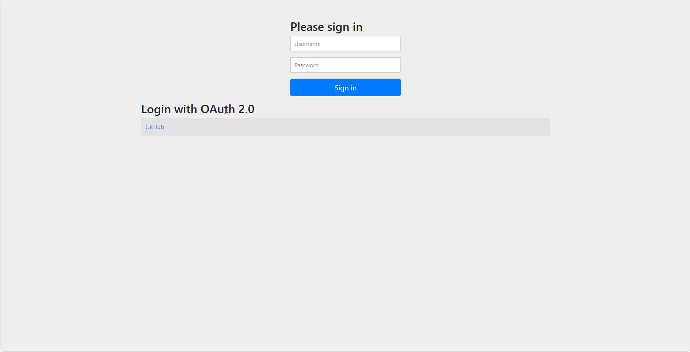
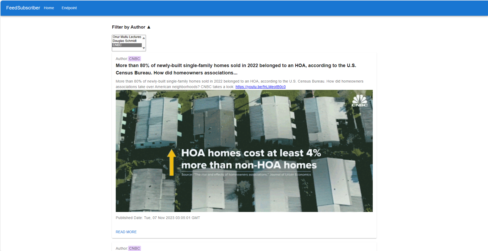
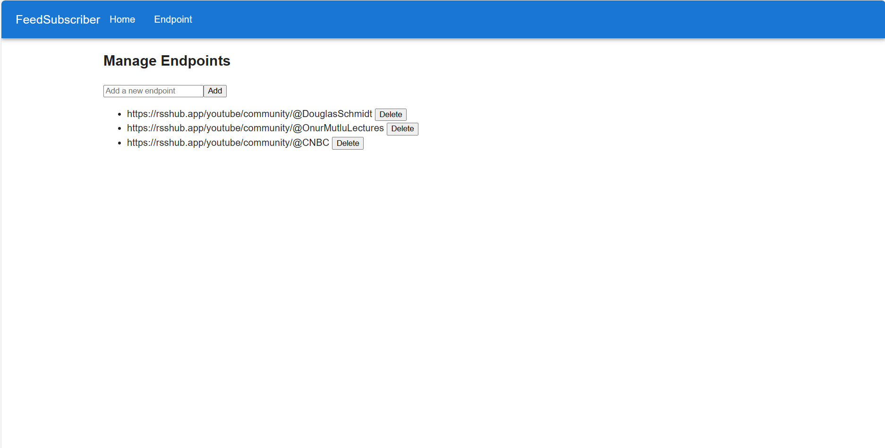

[](https://github.com/hogimn/FeedSubscriber/actions/workflows/gradle.yml)

# Feed Subscriber

## Overview

This is a microservices-based RSS feed subscription system.

1. **collector**:
    - Gathers RSS feeds from user-registered endpoints at set intervals.
    - Stores the collected data into the RSS database.

2. **restful**:
    - API service for handling interactions with RSS and Endpoint databases.
    - Allows users to manage their RSS subscriptions.

3. **eureka**:
    - Acts as a server managing Eureka clients (microservices).
    - Enables microservices to find and communicate with each other.

4. **gateway**:
    - Implemented using Spring Cloud Gateway.
    - Serves as an entry point, managing external requests and providing a unified API for the microservices.

5. **database**:
    - Houses a collection of database-related beans.
    - Provides a centralized repository for managing and organizing database-related components within the Feed
      Subscriber system.

6. **common**:
    - Aggregates commonly used beans.
    - Serves as a shared resource for frequently utilized components, promoting code reuse and maintaining consistency
      across different modules in the Feed Subscriber project.

7. **auth**:
    - Handles OAuth2 authentication for secure user access to Feed Subscriber services.
    - Centralizes authentication logic for consistent and maintainable security across the system.
    - Built upon inspiration and learnings from the belows.
    - https://dev.to/relive27/spring-cloud-gateway-combined-with-the-security-practice-of-oauth20-protocol-1m3b
    - https://github.com/ReLive27/spring-security-oauth2-sample/tree/main/gateway-oauth2-login
    - https://github.com/lspil/full_stack_oauth2

## Database

MySQL is used for auth module and MongoDB for other modules.

### Login



### Home



### Endpoint Setting



## Build

1. Gradle build.

   ```bash
   .\gradlew bootJar
   ```

2. Run each microservice (JDK 19).

   ```bash
   java -jar .\eureka\build\libs\eureka-1.0.0.jar
   ```

   ```bash
   java -jar .\collector\build\libs\collector-1.0.0.jar
   ```

   ```bash
   java -jar .\restful\build\libs\restful-1.0.0.jar
   ```

   ```bash
   java -jar .\auth\build\libs\auth-1.0.0.jar
   ```

   ```bash
   java -jar .\gateway\build\libs\gateway-1.0.0.jar
   ```

3. Build and Run react app.
   ```bash
   npm start
   ```
